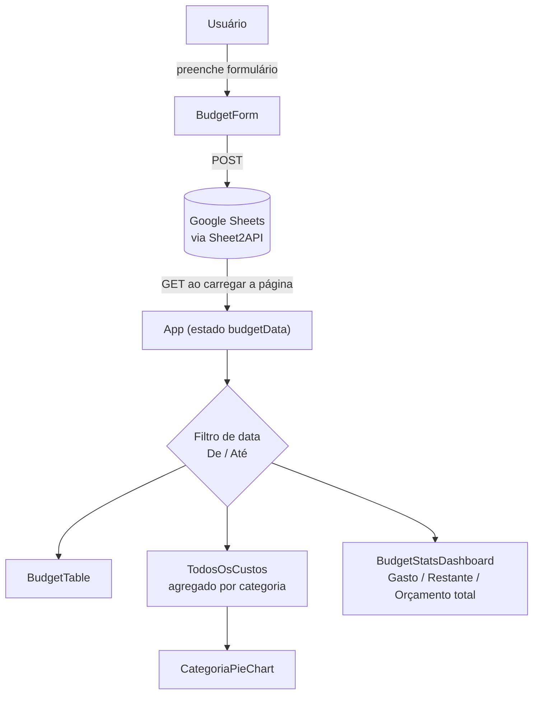
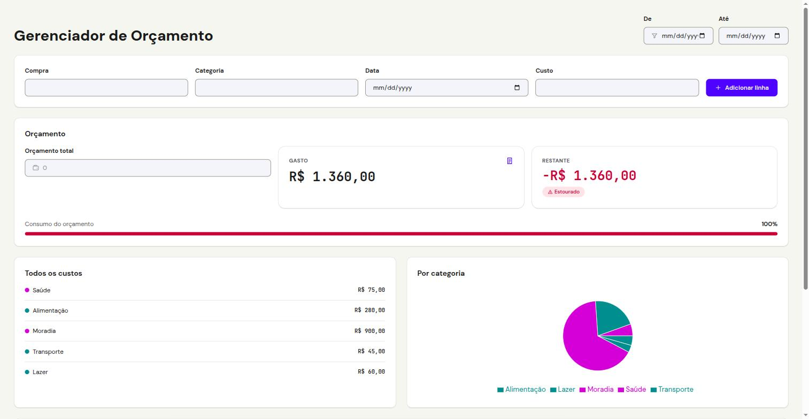

# Gerenciador de Orçamento

Aplicação React para registrar despesas pessoais, categorizá-las e acompanhar o consumo de um orçamento total, usando uma planilha Google Sheets como banco de dados.

**🔗 Demo:** [gerenciador-lilac.vercel.app](https://gerenciador-lilac.vercel.app)

## O problema

Controlar gasto pessoal geralmente cai em um de dois extremos: uma planilha crua, sem validação nem feedback visual (nada te avisa quando estourou o orçamento, categorizar é manual, um gráfico exige montar tudo à mão), ou o oposto — montar um backend com banco de dados só pra um caso de uso de um usuário só.

**Solução:** uma SPA em React que trata uma planilha Google Sheets como banco de dados via [Sheet2API](https://sheet2api.com), sem backend próprio pra hospedar. Cadastro, categorização, filtro por período, gráfico de pizza e painel de orçamento (gasto/restante/limite) tudo no navegador, com a planilha como única fonte de persistência.

**Por que esse desenho e não "montar um backend":** o escopo é uso pessoal e single-user — banco de dados, autenticação e API própria seriam complexidade sem benefício real nessa escala. Google Sheets já é uma UI de planilha gratuita pra quem quiser editar os dados brutos por fora, e o Sheet2API elimina a necessidade de escrever qualquer camada de API.

## Arquitetura



Um único `GET` carrega tudo; o filtro de data recalcula os agregados no cliente, sem nova chamada de rede. `TodosOsCustos` e o gráfico de pizza consomem o mesmo agregado por categoria — uma fonte de dado só, pra bolinha e fatia nunca divergirem em cor ou valor.

## Decisões de design

- **Colunas fixas da tabela (`Compra`/`Categoria`/`Data`/`Custo`)** resolvem uma ambiguidade do briefing original do curso, que tinha conflito entre o wireframe e o texto de requisitos.
- **`TodosOsCustos` mostra dado agregado por categoria, não a lista de despesas individuais** — é esse agregado, e não a tabela bruta, que alimenta o gráfico de pizza, garantindo uma única fonte de verdade para os dois.
- **Sem exclusão remota no Sheets.** O Sheet2API só implementa `addRowToSheets`; `removeRow` mexe só no estado local. Efeito colateral aceito conscientemente: uma linha removida pode reaparecer se a página for recarregada antes de removê-la na planilha.
- **`removeRow` identifica a linha por `id`, não por índice** — necessário porque o filtro de data pode renderizar um subconjunto de `budgetData`; remover por índice da lista filtrada apagaria a linha errada do estado completo.
- **Orçamento total é um input local, sem persistência** — fica só no estado React e reseta ao recarregar. Mantém o escopo simples: é o único dado do app que não vem da planilha.
- **Cor por categoria via hash determinístico compartilhado** entre a bolinha de `TodosOsCustos` e a fatia do `CategoriaPieChart` — mesma função, para as duas visualizações nunca divergirem.
- **JavaScript puro, sem TypeScript, sem gerenciador de estado externo** — decisão de escopo consciente para o nível do projeto (curso de front-end básico), não uma limitação técnica.
- **QA sempre em navegador real, nunca mockado.** Cada funcionalidade tem `requirements.md` + `test-plan.md` escritos antes do código, e cada test-plan é executado por um agente de QA que não conhece a implementação, clicando e preenchendo campos de verdade — CLI ou script simulando o usuário não conta como prova.

## Stack

| Camada | Tecnologia |
|---|---|
| Build tool | Vite |
| UI | React 19 + TailwindCSS v4 |
| Gráfico | Recharts |
| Persistência | Google Sheets + Sheet2API (sem backend próprio) |
| Linguagem | JavaScript (sem TypeScript) |
| Lint | oxlint |
| Deploy | [Vercel](https://gerenciador-lilac.vercel.app), deploy automático a cada push em `main` |

## Como rodar

```bash
npm install
cp .env.example .env
# preencha VITE_SHEET2API_URL com a URL do seu endpoint Sheet2API
npm run dev      # http://localhost:5173
```

```bash
npm run build    # build de produção em dist/
npm run lint     # oxlint
```

## Screenshots



App em produção: formulário de cadastro, painel de orçamento (gasto/restante com barra de progresso por faixa de cor), custos agregados por categoria e gráfico de pizza — mesma paleta determinística nos dois.

## Roadmap

| Etapa | Status |
|---|---|
| Nível 1 — Tabela editável local | ✅ |
| Nível 2 — Integração com Sheet2API | ✅ |
| Nível 3 — Painel de estatísticas + gráfico de pizza | ✅ |
| Nível 4 — Redesign visual (design system próprio, "Front") | ✅ 34/34 itens de QA |
| Deploy — Vercel + CI via GitHub | ✅ |
